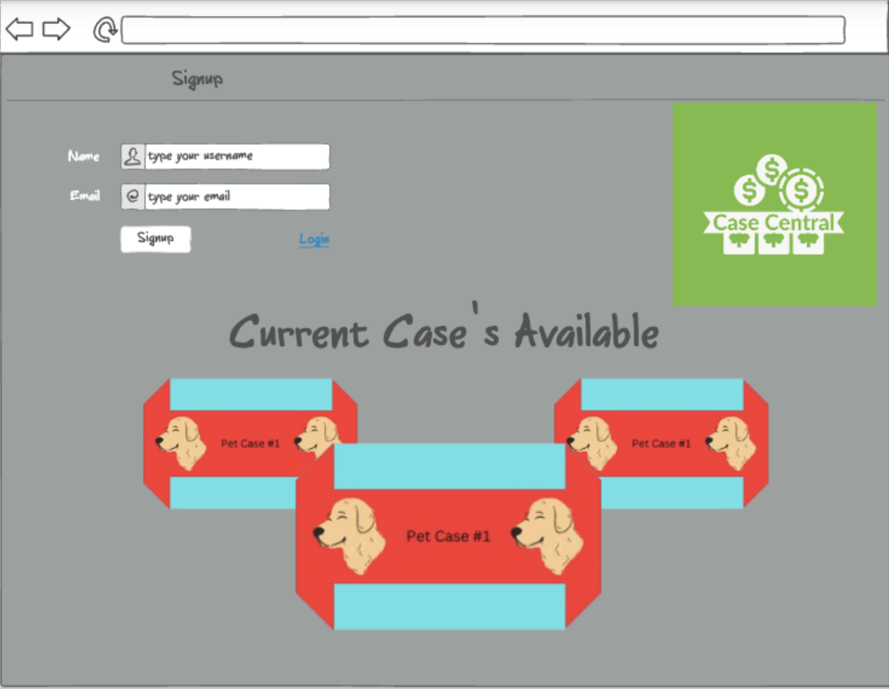
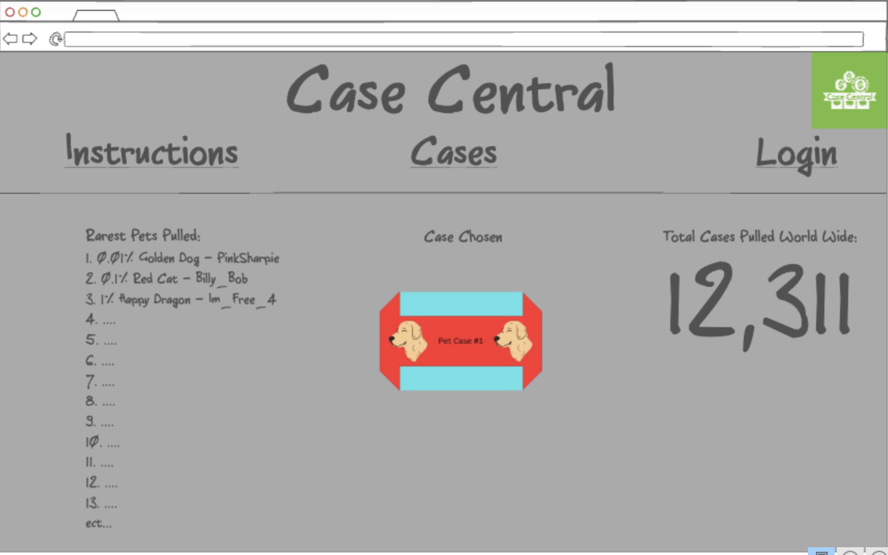
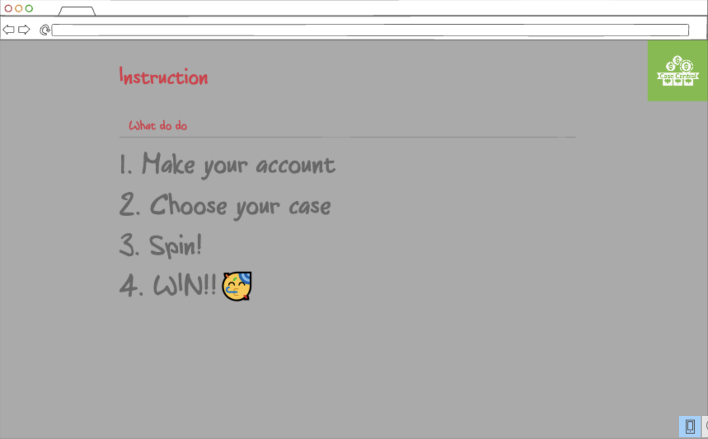
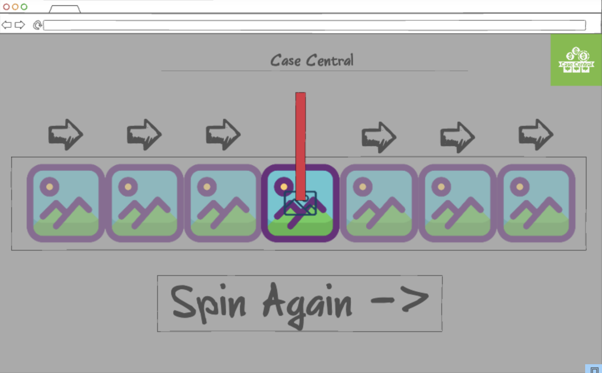

# Startup
Startup for Web Dev 260

Here are some [notes](/notes.md) that are helpfull!

# Case Central
## Elevator pitch

Welcome to Case Central! The ultimate destination for thrilling luck based entertainment! At Case Central you can experience the excitement of spinning many different cases from the comfort of your own home! Our user-friendly platform offers a variety of cases (1 right now more to come) and opportunities to become the luckiest alive, all with just a spin! Whether you're feeling lucky or seeking a dose of excitement, Case Central is the go-to destination for a fun and rewarding experience! Join us today, spin the case's, and let the thrill of chance elevate your entertainment to new heights. Your luck awaits at Case Central!

### Design
Here is the login page where you can login and see the current available cases!

Here is the main page where you can see the top players around the world, total cases opened, and where you can choose which case you would like to open!

Here is where you can find the instruction for how to use the website!

Here is the pop up where you can open the cases and test your luck!

### Key features

- Secure [login](/Login_or_Signup.png) over HTTPS
  - In the Login Screen you can
      - view the available cases
      - signup
      - login
- Once logged in player will be sent to main page
  - [main page](/Main_Screen.png)
  - Player can choose to view [instruction](/Instructions.png), view the [cases available](/Main_Screen.png), or go back to [login page](/Login_or_Signup.png)
  - while in the main page you can
    - View the top player pulls (top 100)
    - See available cases
    - Look at total number of cases opened world wide
- If choosing to go to the [instructions](/Instructions.png) page
  - you can see the simple instructions to the website and how to play
- If choosing to open a case you will be brought to a different [tab or pop-up](/Case_Opening.png) on your screen
  - then you will see your case spinning and landing on your given item
  - you also have a choice to spin again
  - exit to leave
- This will all be stored in a database where a players profile is stored and will be able to keep the tracked data
- more to come
  
### Technologies

I am going to use the required technologies in the following ways.

- **HTML** - Uses correct HTML structure for application. Four HTML pages. One for login/Signup, Instructions, Main Page, and one for Case Opening. Hyperlinks to choice artifact.
- **CSS** - Will be asthetic coloring and pixle art type of creation with proper white spacing and different font
- **JavaScript** - Provides login, choice display, applying case opeings, display other users openes, backend endpoint calls.
- **Service** - Backend service with endpoints for:
  - login/signup
  - Retreiving player data
  - Finding other player pulls
  - updating scoreboards
- **DB/Login** - Store users, Cases that they own in database. Register and login users. Credentials securely stored in database.
- **WebSocket** - As new rarities are opened, best will be displayed in top 100
- **React** - Application ported to use the React web framework.

## HTML deliverable

For this deliverable I built out the structure of my application using HTML.

- **HTML pages** - Three HTML pages and a pop-up page that represent the ability to login/signup, see leaderboard/cases, read Instructions, and shows the spinning animation that will occur for the pop up.✅
- **Links** - The login page automatically links to the main page where you can navigate to the Login, Main, and Instruction pages and each case clicked will have a pop up to spin.✅
- **Text** - Text to login, Text to guide around the main page to cases, leaderboards and counter, text for instructions, text for pop up.✅
- **Third Party Serivce** - On instructions page, Joke API representation, and dog picture api (figuring out which one to use).✅
- **Images** - Imiges including, logo on every page, the different cases, pop-up representation of inside a case, and Joke image.✅
- **DB/Login** - Database for storing login info and placing it on the main page, as well as storing rarest pet pulled.✅
- **DB/WebSocket** - The real time change of the rarest pet leaderboard and using the DB to find and use rarest pets. Also including a real time counter for total cases opened world wide.✅

## CSS deliverable

For this deliverable I properly styled the application into its final appearance.

- **Header, footer, and main content body**✅
- **Navigation elements** - I added buttons which you can tell by outlined borders, and finalized the login/signup page with it being able to be more visable, also I created a animation of the pop up popping a little bit showing what the JS will do, and allowed buttons to change colors while hovering✅
- **Responsive to window resizing** - I used flex to make my application look great on all devices✅
- **Application elements** - I used good colors that go well with each other in my opinion and also used linear gradient to have a more appeasing look while also changing the cover of buttons when hovering.✅
- **Application text content** - I used consitant fonts and sizes✅
- **Application images** - Made the logo and cases a circle, had the dog api placed pleasently in the middle of the screen and with rounded edges, and tried to make the pop up dogs more appeasing to look at.✅

## JavaScript deliverable

For this deliverable I implemented by JavaScript so that the application works for a single user. I also added placeholders for future technology.

- **login** - When you press the login button or the signup button it will take you to the main page.✅
- **database** - The login page takes user input, creates a new user object, stores it in localStorage, and alerts the user. The main page simulates spins and updates the DOM based on simulated data. The instructions page fetches a random dog image from an external API. Aswell shows the total number of cases spun and adds to the counter for each spin.✅
- **WebSocket** - The simulation of other players opening cases and being placed on the resent cases opened leaderboard in the code does serves as a simulation of websockets. Which will eventually allow for real-time updates from the server, and the simulation of other players opening cases when websocketing is implemented. This will also update the casees opened counted real time from any player to show the total number of cases ever opened.✅
- **application logic** -  The interaction logic is when you click on the case, a pop up will occure spinning different animals till you land on one at random with chance, whch then will be displayed on the screen of which pet you pulled and aswell added onto the leaderboard of recent cases opened.✅

## Service deliverable

For this deliverable, I incorporated backend endpoints in my code to handle registering, random dog api, and spinning cases. These endpoints receive information about user's email, random dog images, and also the spins and return the updated statistics, such as the total number of cases opened.

- **Node.js/Express HTTP service** - The index.js file sets up an Express server, defines routes for registration, login, adding scores, and handling dog images.✅
- **Static middleware for frontend** - The line app.use(express.static('.')); in my index.js file indicates that the frontend files (HTML, CSS, JS) will be served using the Express static middleware.✅
- **Calls to third party endpoints** - In the instructions.js file, I'm making a call to a third-party service (https://dog.ceo/api/breeds/image/random) to fetch a random dog image.✅
- **Backend service endpoints** - I've implemented several service endpoints in my index.js file (/api/register, /api/login, /api/addScore, and /api/dogImage) to handle user registration, login, adding scores, and receiving dog images.✅
- **Frontend calls service endpoints** - In my login.js and mainscreen.js files, I'm making fetch requests to my service endpoints (/api/register, /api/addScore, and others) to interact with my backend.✅

## DB/Login deliverable

For this deliverable I stored logins within the database

- **Supports new user registration** - done, creates a new account for the user!✅
- **Supports existing user authentication** - done, recognizes and logs in existing user!✅
- **Stores application data in MongoDB** - uses MongoDB.✅
- **Stores and retrieves credentials in MongoDB** - done, does this!✅
- **Restricts application functionality based upon authentication** - done, !✅

## WebSocket deliverable

For this deliverable I used webSocket to update the Case Count on the frontend in realtime.

- **Backend listens for WebSocket connection** - done!
- **Frontend makes WebSocket connection** - done!
- **Data sent over WebSocket connection** - done!
- **WebSocket data displayed** - done!
